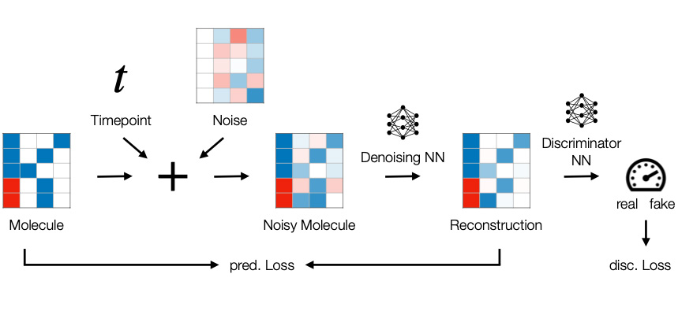
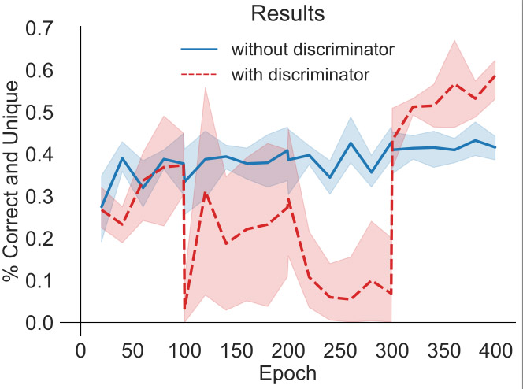

# MoleculeDiffusionGAN
<div style="text-align:center;">

</div>
WIP implementation of a discriminator-guided diffusion model for molecule generation. 

This repository provides a proof-of-concept implementation for the manuscript _[Discriminator-Driven Diffusion Mechanisms for Molecular Graph Generation](https://github.com/gerritgr/MoleculeDiffusionGAN/blob/main/Discriminator_Guided_Diffusion_for_Molecule_Generation.pdf)_.


## Results
<div style="text-align:center;">

</div>

## Run DSNN 

### On Colab
You can run the notebook on Google Colab after installing some packags. 

### Locally

You can run DSNN locally using _main.ipynb_. First, install Anaconda, then create an environment with the Python dependencies (tested on _OS X_):

```console
conda env create -f environment.yml -n moldiffgan
conda activate moldiffgan
jupyter lab
```
Then just run the notebook(s) from start to finish. 

### Via Docker
Install docker and then:
```console
docker pull gerritgr/moleculediffusiongan:latest
docker run -p 8888:8888 gerritgr/moleculediffusiongan:latest
```
You need to manually copy the URL to your browser, navigate to the notebook, and activate the _moldiffgan_ kernel (`Kernel -> Change Kernel...`). 
